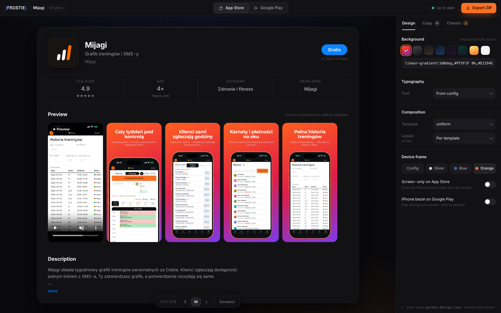
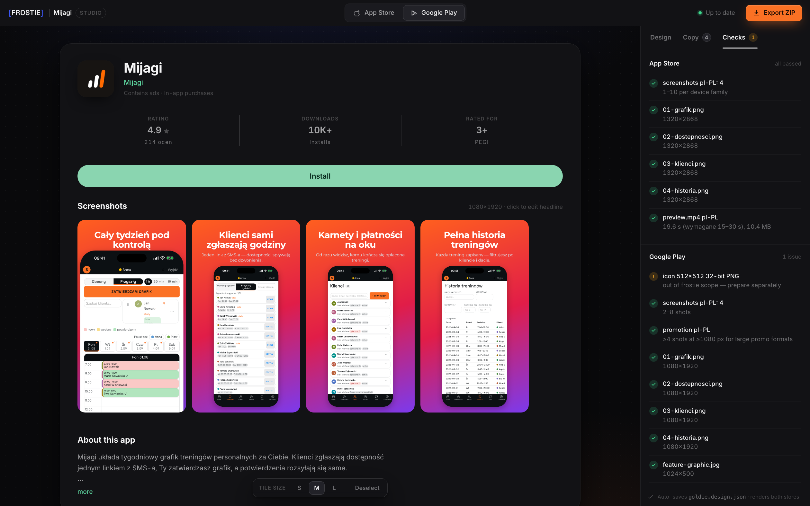

# frostie ❄️ (wersja polska)

[English version → README.md](README.md)

Plugin Claude Code, który produkuje **zasoby sklepowe App Store i Google Play w jednym
przebiegu**. W pełni samodzielny: silnik renderowania/przechwytywania jest zvendorowany w
`engine/` (build [goldie](https://github.com/kacperkapusciak/goldie), MIT — patrz
`engine/NOTICE.md`), serwer MCP argent jest bundlowany przez `.mcp.json`.

## Co robi

- **iOS / App Store**: eksploruje appkę na symulatorze przez [argent](https://github.com/software-mansion/argent)
  (bundlowany serwer MCP), odtwarza flow YAML argenta, przechwytuje surowe ekrany i klipy,
  renderuje screenshoty z ramką + czyste wideo app preview.
- **Google Play**: re-renderuje *te same* capture'y i design w specyfikacji Play —
  screenshoty telefonu **1080×1920** (≥4 kwalifikują się do dużych formatów polecania) oraz
  obowiązkowy **feature graphic 1024×500** (JPEG; Play odrzuca PNG z alfą). Domyślnie
  screen-only — bez sprzętu Apple na liście Play.
- **Dwusklepowe studio na żywo** (`http://localhost:4322`): przestrzeń robocza jak w edytorze —
  strona produktu App Store albo listing Play na kanwie, po prawej inspektor Design / Copy /
  Checks; klik w screenshot przenosi do jego nagłówka. Tło, font, template, layout globalny i per kafel,
  kolejność kafli (↑/↓), wariant ramki, przełączniki screen-only / ramki Play i nagłówki per
  kafel — każda zmiana auto-zapisuje wspólny `goldie.design.json` i re-renderuje **oba**
  sklepy server-side w około sekundę. Do tego panel weryfikacji reguł Apple + Play i
  jednoklikowy **eksport ZIP gotowy do uploadu** z zasobami obu sklepów.

Jeden config (`goldie/goldie.config.ts`), jeden zestaw flow (`.argent/flows/`), jeden
design — każdy istniejący projekt goldie działa z frostie bez zmian.

## Studio

| App Store | Google Play |
|---|---|
|  |  |

## Instalacja

Jako plugin Claude Code (bundluje serwer MCP argent):

```
/plugin marketplace add clone147/frostie
/plugin install frostie@frostie
```

Wymagania: macOS z symulatorami Xcode, Node 20+, `ffmpeg`.

## Użycie

Powiedz „zrób screenshoty do sklepu" (albo `/frostie`) w repo aplikacji — Claude prowadzi
cały pipeline. Ręcznie:

```bash
export GOLDIE_CONFIG=<repo-appki>/goldie/goldie.config.ts
node scripts/frostie.mjs doctor && node scripts/frostie.mjs capture && node scripts/frostie.mjs frame
node scripts/play-export.mjs      # zestaw Google Play + feature graphic (+ --bezel)
node scripts/studio.mjs           # dwusklepowe studio na żywo → http://localhost:4322
node scripts/frostie.mjs preview  # wideo App Store preview 15–30 s
```

Wyniki: `out/screenshots/<device>/`, `out/screenshots/play/<locale>/`,
`out/play/feature-graphic.jpg`, `out/previews/**/preview.mp4` oraz
`out/frostie-export.zip` z przycisku Export w studiu.

Dokumentacja: `skills/frostie/SKILL.md` (pełny workflow),
`skills/frostie/references/config.md` (schemat configu),
`skills/frostie/references/flows.md` (flow YAML).

## Licencja

MIT. Zvendorowany build silnika w `engine/` pochodzi z
[goldie](https://github.com/kacperkapusciak/goldie) (MIT) autorstwa Kacpra Kapuściaka —
patrz `engine/LICENSE` i `engine/NOTICE.md`. Nazwy plików configu
(`goldie.config.ts`, `goldie.design.json`) zostają dla kompatybilności drop-in z
istniejącymi projektami.
